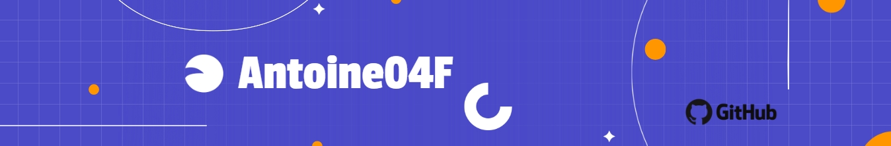

&nbsp;&nbsp;&nbsp;&nbsp;&nbsp;&nbsp;&nbsp;&nbsp;

## ⚙️ Mes competences en Data 

<table>
  <tr>
    <td align="center" width="100">
      
       Excel
    </td>
    <td align="center" width="100">
      
       Tableau
    </td>
    <td align="center" width="100">
      
       Pyhton
    </td>
        <td align="center" width="100">
      
       Knime
    </td>
        <td align="center" width="100">
      
       Git
    </td>
        <td align="center" width="100">
      
       Powerbi
    </td>
    
 </tr>
</table>
  
## 📊 Mes Projets 
