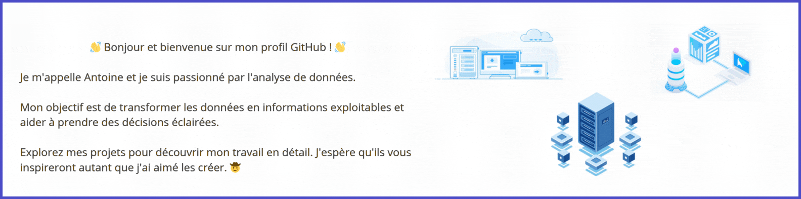

&nbsp;&nbsp;&nbsp;&nbsp;&nbsp;&nbsp;&nbsp;&nbsp;

## ⚙️ Mes competences en Data 

  

    
    
Excel

  

  

    
    
Tableau

  

  

    
    
Python

  

  

    
    
Knime

  

  

    
    
Git

  

  

    
    
Powerbi

  

  
## 📊 Mes Projets 

<!--Footer--> 

  

